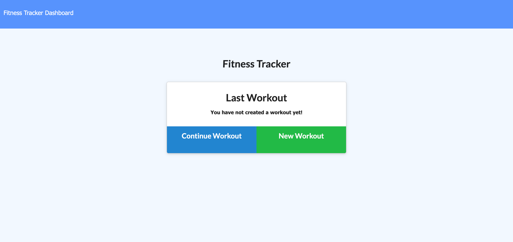

# Workout Tracker

---

A webapp that will track workouts with duration and weight used. A consumer will reach their fitness goals more quickly when they track their workout progress.

---

## Requirements

The user should be able to:

* Add exercises to the most recent workout plan.
* Add new exercises to a new workout plan.
* View the combined weight of multiple exercises from the past seven workouts.
* View the total duration of each workout from the past seven workouts.

## Links

* [Workout Tracker](https://wessex-workout-tracker.herokuapp.com/)
* [Github Repository](https://github.com/JonDnv/WorkoutTracker)
  
---

## Mock Up

The following image shows the finished site:

---

## Change History

 1. Created Shell File Structure
 2. Created Heroku App
 3. Set Up MongoDB Atlas
 4. Completed Backend Application
